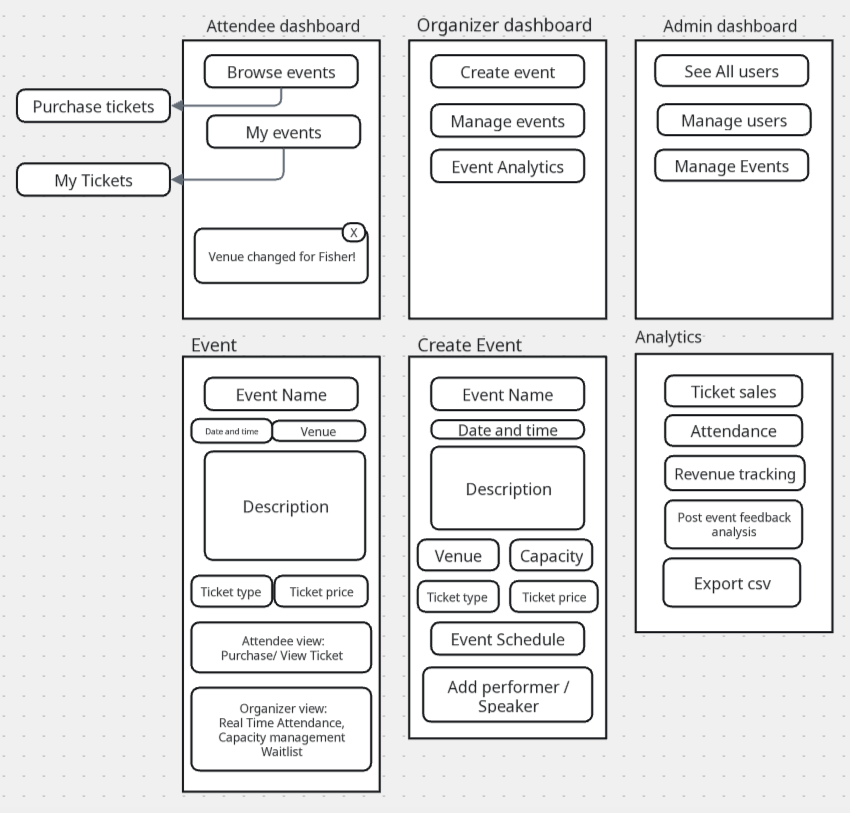

# Event Management Platform
Develop a comprehensive event management system that allows event organizers to create, manage, and promote events while enabling attendees to discover, register for, and participate in events. The system should handle complex event logistics and provide real-time updates.

<br />
## Objective
Create a scalable web application that streamlines the entire event lifecycle from creation to post-event analytics, supporting multiple event types and user roles.

## Features: 
- [x] CRUD operations (Create, Read, Update, Delete).
- [ ] Multi-Role User System: Support for event 
  - [ ] organizers, 
  - [ ] attendees, 
  - [ ] vendors, and 
  - [ ] platform administrators (with role-specific dashboards and permissions)
- [ ] Event Creation and Management: 
Organizers can create events with:
  - [x] detailed information, 
  - [ ] set ticket types and pricing, 
  - [ ] manage venue details,
  - [ ] create event schedules, and 
  - [ ] handle speaker/performer management
- [ ] Registration and Ticketing System: 
Attendees can:
 - [ ] browse events, 
 - [ ] purchase tickets with integrated payment processing,
 - [ ] receive QR code tickets
 - [ ] and manage their event registrations
- [ ] Real-Time Event Updates: 
 - [ ] Live notifications for schedule changes
 - [ ] venue updates, and important announcements with support for 
   - [ ] push notifications 
   - [ ] email alerts
- [ ] Check-In and Attendance Tracking: 
  - [ ] QR code scanning system for event entry
  - [ ] real-time attendance monitoring 
  - [ ] and capacity management with 
  - [ ] waitlist functionality
- [ ] Analytics and Reporting Dashboard: 
   - [ ] Comprehensive analytics for organizers: 
      - [ ] including ticket sales, 
      - [ ] attendance patterns, 
      - [ ] revenue tracking
      - [ ] post-event feedback analysis with 
      - [ ] exportable reports


## [Link to a live project.](https://event-management-platform.onrender.com/)
## How to initialize and set up:
### Prerequisites
- Node 18+
- npm
- PostgreSQL (13+)

### Setup
```bash
# clone
git clone https://github.com/alexcheva/event-management-platform.git
cd event-management-platform

# install
npm install

# run backend
npm run dev

# run frontend
npm start
```

## Dependencies 

### Core Dependencies

| Package            | Purpose                                                                                                                                                                                         |
| ------------------ | ----------------------------------------------------------------------------------------------------------------------------------------------------------------------------------------------- |
| **express**        | Lightweight Node.js web framework for building APIs and handling HTTP requests/responses.                                                                                                       |
| **cors**           | Enables [CORS (Cross-Origin Resource Sharing)](https://developer.mozilla.org/en-US/docs/Web/HTTP/CORS) to allow requests from different origins — essential for frontend–backend communication. |
| **dotenv**         | Loads environment variables from a `.env` file into `process.env` for secure configuration (e.g., database URLs, API keys).                                                                     |

### Development Dependencies
| Package            | Purpose                                                                                                                                        |
| ------------------ | ---------------------------------------------------------------------------------------------------------------------------------------------- |
| **nodemon**        | Watches for file changes and automatically restarts the server — speeds up development workflow.                                               |

## Database setup
```bash
psql -U insert_your_username -f database_dump.sql 
```
### Database dump location
`./database_dump.sql`

## Routes 

### Auth
| Method   | Endpoint         | Description       |
| -------- | ---------------- | ----------------- |
|`POST` | `/api/auth/register` | create user (role optional) |
|`POST` | `/api/auth/login` | returns access + refresh tokens |
|`POST` | `/api/auth/refresh` | refresh token |

### Events (organizer & public)
| Method   | Endpoint         | Description       |
| -------- | ---------------- | ----------------- |
|`GET` | `/api/events` | browse + filters (date, location, type) |
|`GET` | `/api/events/:id` | event detail + schedule + ticket types |
|`POST` | `/api/events` | create (organizers only) |
|`PUT` | `/api/events/:id` | update (organizer) |
|`DELETE` | `/api/events/:id` | cancel/delete (organizer/admin) |

### Tickets / Registration
| Method   | Endpoint         | Description       |
| -------- | ---------------- | ----------------- |
|`POST` | `/api/events/:id/purchase` | create payment session (Stripe)
|`POST`|` /api/webhooks/stripe` | handle payment success -> create Ticket, send QR
|`GET `|`/api/users/:id/tickets` | user tickets
|`POST`|` /api/tickets/:id/transfer` | optional transfer
|`GET `|`/api/events/:id/attendees` | organizer-only list

### Check-in
| Method   | Endpoint         | Description       |
| -------- | ---------------- | ----------------- |
|`POST` | `/api/checkin/scan` | verify QR code & mark attendance
| `GET` | `/api/events/:id/attendance` | live attendance metrics

### Analytics / Reports
| Method   | Endpoint         | Description       |
| -------- | ---------------- | ----------------- |
| `GET` | `/api/organizer/:id/analytics?eventId=` | returns ticket sales, revenue, attendance |
|`POST` | `/api/organizer/:id/export` | generate CSV/PDF (background job) |

### Realtime (Socket.io)

Namespace /events/:id for event live updates: schedule:update, announcement, capacity:update, checkin:update.

## Tests
concise summary of at least two included 
| Test   | Description       |
| -------- | ----------------- |

## Entities:

- **User** _(id, name, email, role, hashedPassword, settings)_

- **Event** _(id, organizerId, title, description, venueId, startAt, endAt, capacity, status)_
- **Venue** _(id, name, address, capacity, mapLink)_

- **TicketType** _(id, eventId, name, price, quantity, salesStart, salesEnd)_

- **Ticket** _(id, ticketTypeId, purchaserId, qrCode, status)_

- **Registration** _(id, userId, eventId, ticketId, status)_

- **ScheduleItem** _(id, eventId, title, startAt, endAt, speakers[])_

- **Speaker** _(id, name, bio, socialLinks)_

- **Vendor** _(id, companyName, contact, boothNumber)_

- **Attendance** _(id, eventId, userId, checkInAt, checkInMethod)_